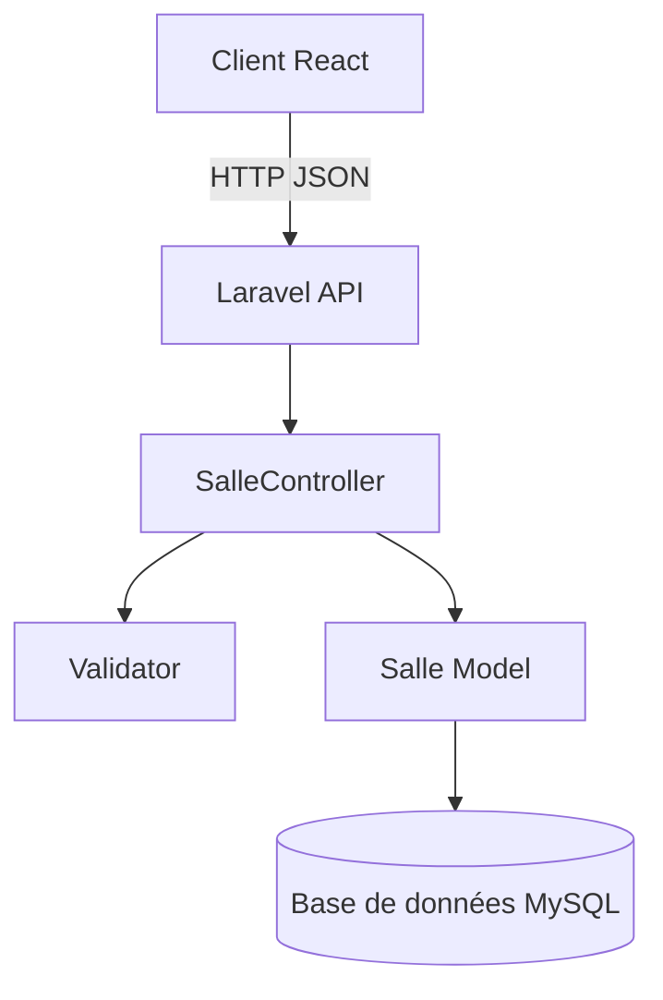

# Design Document — Gestion des Salles

## Overview

Ce module expose une API REST Laravel pour gérer les salles d'un établissement, et une interface React pour les consulter et les administrer. Il s'intègre dans un système plus large. Les opérations principales sont : lister, créer, modifier et désactiver (soft-delete) des salles.

---

## Architecture



- Le client React communique avec l'API via des requêtes HTTP JSON.
- Laravel gère le routage, la validation et la persistance.
- La base de données stocke les salles avec un soft-delete via le champ `active`.

---

## Components and Interfaces

### API Endpoints

| Méthode | Route              | Action                        |
|---------|--------------------|-------------------------------|
| GET     | /api/salles        | Lister les salles actives     |
| POST    | /api/salles        | Créer une salle               |
| PUT     | /api/salles/{id}   | Modifier une salle            |
| DELETE  | /api/salles/{id}   | Désactiver une salle          |

### SalleController

```php
// index()  → retourne Salle::where('active', true)->get()
// store()  → valide + crée + retourne 201
// update() → valide + met à jour + retourne la salle
// destroy()→ passe active=false + retourne message
```

### Client React

- `SalleList` : composant affichant le tableau des salles
- `SalleForm` : formulaire de création
- `useSalles` : hook gérant les appels API et l'état local

---

## Data Models

### Table `salles`

| Colonne      | Type         | Contraintes                  |
|--------------|--------------|------------------------------|
| id           | bigint       | PK, auto-increment           |
| code         | varchar      | unique, not null             |
| nom          | varchar      | not null                     |
| type         | varchar      | not null                     |
| capacite     | integer      | not null, min: 1             |
| equipements  | varchar      | nullable                     |
| batiment     | varchar      | nullable                     |
| etage        | integer      | nullable                     |
| active       | boolean      | default: true                |
| created_at   | timestamp    |                              |
| updated_at   | timestamp    |                              |

### Modèle Eloquent `Salle`

```php
protected $fillable = [
    'code', 'nom', 'type', 'capacite',
    'equipements', 'batiment', 'etage', 'active'
];
```

---

## Correctness Properties

*Une propriété est une caractéristique ou un comportement qui doit être vrai pour toutes les exécutions valides du système — c'est une déclaration formelle de ce que le système doit faire. Les propriétés servent de pont entre les spécifications lisibles par l'humain et les garanties de correction vérifiables par machine.*

### Property 1 : Filtre des salles actives (round-trip désactivation)

*Pour toute* salle créée puis désactivée via DELETE, un appel GET `/api/salles` ne doit pas inclure cette salle dans les résultats.

**Validates: Requirements 1.2, 4.3**

---

### Property 2 : Création persistée

*Pour toute* salle créée avec des données valides via POST, la salle doit être présente en base de données avec les mêmes attributs que ceux envoyés.

**Validates: Requirements 2.1**

---

### Property 3 : Rejet des codes invalides à la création

*Pour tout* code absent ou déjà utilisé par une salle existante, une requête POST doit être rejetée avec HTTP 422.

**Validates: Requirements 2.2**

---

### Property 4 : Rejet des capacités invalides

*Pour toute* valeur de `capacite` inférieure ou égale à 0, nulle ou absente, une requête POST doit être rejetée avec HTTP 422.

**Validates: Requirements 2.4**

---

### Property 5 : Mise à jour persistée

*Pour toute* salle existante et tout ensemble de données valides envoyées via PUT, les attributs de la salle en base doivent correspondre aux nouvelles valeurs après la requête.

**Validates: Requirements 3.1**

---

### Property 6 : Unicité du code à la modification

*Pour toutes* deux salles distinctes A et B, tenter de modifier A pour lui donner le code de B doit être rejeté avec HTTP 422.

**Validates: Requirements 3.3**

---

### Property 7 : Désactivation soft-delete

*Pour toute* salle existante, après une requête DELETE, le champ `active` de cette salle doit valoir `false` en base de données.

**Validates: Requirements 4.1**

---

## Error Handling

| Situation                        | Code HTTP | Réponse                              |
|----------------------------------|-----------|--------------------------------------|
| Validation échouée               | 422       | `{ "errors": { ... } }`             |
| Salle introuvable (PUT/DELETE)   | 404       | `{ "message": "Not Found" }`        |
| Champs inconnus dans la requête  | 200/201   | Ignorés silencieusement             |
| Succès désactivation             | 200       | `{ "message": "Salle désactivée" }` |

---

## Testing Strategy

### Approche duale

Les tests sont organisés en deux catégories complémentaires :

**Tests unitaires / exemples** :
- Vérifier qu'un formulaire React contient les bons champs
- Vérifier qu'un message d'erreur s'affiche quand l'API retourne 422
- Vérifier que les champs inconnus sont ignorés (exemple concret)
- Vérifier le comportement 404 sur des IDs inexistants

**Tests basés sur les propriétés (PBT)** :
- Valider les propriétés universelles listées ci-dessus
- Utiliser [Pest](https://pestphp.com/) pour PHP avec le plugin `pestphp/pest-plugin-faker` pour générer des données aléatoires
- Minimum 100 itérations par propriété
- Chaque test doit référencer la propriété du design avec le format :
  `// Feature: gestion-salles, Property N: <texte de la propriété>`

### Framework de test

- **Backend** : Pest (Laravel) avec `RefreshDatabase` trait
- **Frontend** : Vitest + React Testing Library

### Couverture attendue

| Propriété | Type de test     | Itérations |
|-----------|------------------|------------|
| Property 1 | PBT (round-trip) | 100        |
| Property 2 | PBT              | 100        |
| Property 3 | PBT              | 100        |
| Property 4 | PBT              | 100        |
| Property 5 | PBT              | 100        |
| Property 6 | PBT              | 100        |
| Property 7 | PBT              | 100        |
